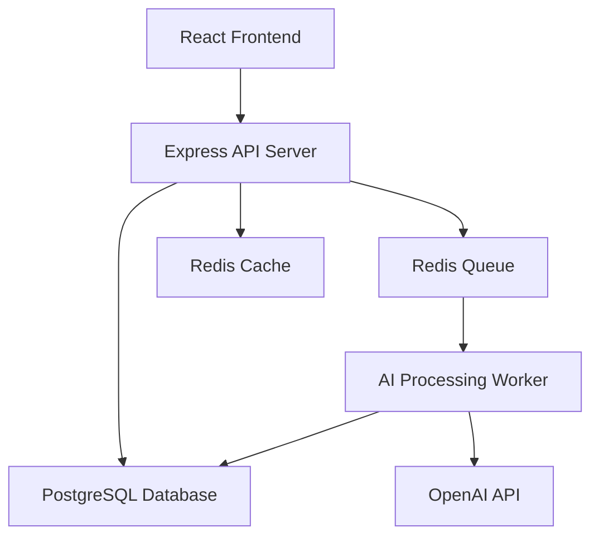

# TruthLens AI - Design Document

## 1. System Overview

TruthLens AI is a web-based platform that verifies student identity through institutional email while enabling anonymous feedback posting. The system uses a REST API backend with AI processing pipelines to detect spam, classify content themes, analyze sentiment, and generate aggregated insights. The architecture separates user identity from content authorship to maintain anonymity while ensuring only verified students can post.

## 2. High-Level Architecture

The system follows a three-tier architecture with a React frontend, Node.js/Express backend, and PostgreSQL database. AI processing occurs asynchronously through a job queue that interfaces with OpenAI API for content analysis.

**Key Components:**
- Frontend handles user interactions and displays insights
- API server manages authentication, content CRUD, and filtering
- Database stores users, posts, and analysis results separately
- Job queue processes AI tasks asynchronously
- Worker service calls OpenAI API and stores results
- Cache layer improves read performance for insights

## 3. Core Modules

### Authentication Module
Handles email verification, session management, and anonymous token generation for verified users.

### Content Management Module
Manages post creation, editing, deletion, and retrieval with anonymization layer between user identity and content.

### AI Processing Module
Orchestrates spam detection, theme classification, and sentiment analysis through OpenAI API calls.

### Insight Generation Module
Aggregates analyzed posts to generate institution-level summaries, theme distributions, and sentiment trends.

### Admin Dashboard Module
Provides content moderation tools, user management, and system analytics for administrators.

### Search & Filter Module
Enables full-text search and multi-dimensional filtering by institution, theme, sentiment, and date range.

## 4. Data Flow

1. **User Registration**: Student submits institutional email → system sends verification link → user confirms → account created with verified status
2. **Anonymous Posting**: Verified user creates post → system generates anonymous author ID → post saved with anonymous ID (not user ID)
3. **AI Processing Trigger**: New post queued → worker picks up job → sends content to OpenAI API for analysis
4. **Spam Detection**: AI analyzes post content → returns spam probability score → posts above threshold flagged for review
5. **Theme Classification**: AI categorizes post into themes (academics, campus life, facilities, etc.) → results stored in post metadata
6. **Sentiment Analysis**: AI determines sentiment polarity and intensity → sentiment score stored with post
7. **Insight Generation**: Aggregation service queries analyzed posts → calculates statistics by institution/theme → generates summary insights
8. **Content Retrieval**: User requests filtered content → API queries database with filters → returns anonymized posts with AI metadata

## 5. AI Components Used

### OpenAI GPT-4 API
Primary AI engine for content analysis using structured prompts for three tasks:

**Spam Detection:**
- Prompt instructs model to identify promotional content, gibberish, harassment, and off-topic posts
- Returns binary classification with confidence score
- Threshold set at 0.7 for automatic flagging

**Theme Classification:**
- Multi-label classification into predefined categories: Academics, Campus Life, Social Environment, Career Services, Facilities, Administration, Other
- Uses few-shot prompting with examples for each category
- Returns ranked list of applicable themes

**Sentiment Analysis:**
- Three-class classification: Positive, Neutral, Negative
- Returns sentiment label with intensity score (0-1)
- Aggregated at institution and theme levels for insights

**Implementation Approach:**
- Single API call per post with structured JSON response containing all three analyses
- Retry logic with exponential backoff for API failures
- Results cached to avoid reprocessing unchanged content

## 6. Privacy & Security Design

### Anonymity Architecture
- User accounts stored in `users` table with email and verification status
- Posts stored in `posts` table with `anonymous_author_id` (UUID), not `user_id`
- Mapping table `user_post_mapping` links users to their posts for edit/delete permissions only
- Mapping table accessible only to backend, never exposed via API
- Public APIs return posts without any user identifiers

### Authentication Security
- JWT tokens for session management with 24-hour expiration
- Email verification required before posting privileges granted
- Rate limiting: 10 posts per user per day, 100 API requests per hour per IP
- Password hashing using bcrypt with salt rounds of 12

### Data Protection
- HTTPS enforced for all connections
- Database credentials stored in environment variables
- API keys encrypted at rest
- User emails never displayed publicly or in post metadata

### Content Moderation
- Admins can flag/remove posts but cannot see author identity
- Audit logs track all admin actions with timestamps
- Users can delete their own posts, removing all traces

## 7. MVP Limitations

**Scope Constraints:**
- US institutions with .edu domains only
- No mobile app, web-only interface
- English language content only
- Maximum 5 institutions for initial launch

**Feature Limitations:**
- No real-time updates, manual refresh required
- No user profiles or reputation systems
- No direct messaging between users
- No image or file uploads, text-only posts
- No advanced search filters (e.g., by major, year)

**AI Limitations:**
- Dependent on OpenAI API availability and rate limits
- No custom-trained models, using general-purpose GPT-4
- Spam detection may have false positives requiring manual review
- Theme classification limited to 7 predefined categories
- No multilingual support

**Performance Constraints:**
- AI processing not real-time, 30-60 second delay for analysis
- Insight generation runs on-demand, not pre-computed
- No CDN for static assets
- Single database instance without replication

**Security Gaps:**
- No advanced bot detection beyond rate limiting
- No email domain verification beyond format checking
- No two-factor authentication
- Basic SQL injection protection only through parameterized queries

**Operational Limitations:**
- Manual user verification approval for edge cases
- No automated backup system
- No monitoring or alerting infrastructure
- Admin dashboard has basic functionality only
